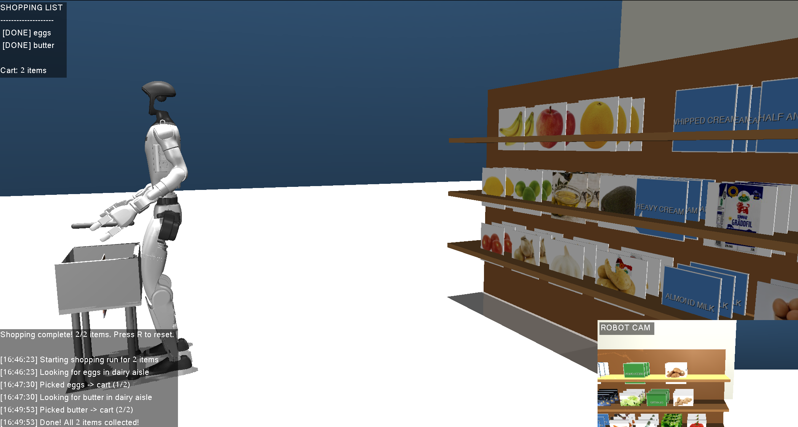

# Sous Bot 🤖🛒

**An assistive grocery robot for visually impaired and elderly users.**

Sous Bot understands your meal plan, generates a shopping list, and autonomously fetches items in a simulated grocery store — powered by a Unitree G1 humanoid robot.



## Architecture

```
┌─────────────────────────────────────────────────────┐
│                   Sous Bot System                    │
├─────────────┬──────────────┬────────────────────────┤
│  PERCEIVE   │    REASON    │         ACT            │
│             │              │                        │
│ Robot RGBD  │ Meal Planner │ MuJoCo Sim / G1 Robot  │
│  Camera     │ (Llama 3.3) │                        │
│     ↓       │     ↓        │ - Navigate aisles      │
│ Vision VLM  │ Shopping     │ - Locate items (VLM)   │
│ (Qwen2.5-VL)│ List Gen    │ - IK arm reaching      │
│     ↓       │     ↓        │ - Dexterous grasping   │
│ Shelf       │ Recipe       │ - Place in cart         │
│ Detection   │ Search       │                        │
├─────────────┴──────────────┴────────────────────────┤
│              FastAPI Backend (T1 API)                │
│         /chat  ·  /shopping-list  ·  /scan          │
└─────────────────────────────────────────────────────┘
```

## Models

| Component | Model | Provider |
|-----------|-------|----------|
| **Planner LLM** | `meta-llama/Llama-3.3-70B-Instruct-fast` | Nebius Token Factory (`api.tokenfactory.nebius.com`) |
| **Vision VLM** | `Qwen/Qwen2.5-VL-72B-Instruct` | Nebius AI Studio (`api.studio.nebius.com`) |
| **Recipe Search** | Tavily Web Search API | Tavily |

All LLM calls use the OpenAI Python SDK pointed at Nebius endpoints.

## Tech Stack

- **LLM**: Nebius Token Factory (Llama 3.3 70B) for meal planning + shopping list generation
- **Vision**: Nebius AI Studio (Qwen2.5-VL 72B) for shelf scanning + item localization
- **Simulation**: MuJoCo with Unitree G1 (29-DOF + dexterous hands)
- **Backend**: Python 3.13+, FastAPI, uvicorn
- **Package Manager**: [uv](https://docs.astral.sh/uv/)
- **IK Solver**: Damped least-squares (SciPy)
- **Recipe Search**: Tavily API for web-grounded recipe lookup

## Project Structure

```
sous-bot/
├── config/
│   └── settings.yaml          # Model endpoints, API config
├── src/sous_bot/
│   ├── api/                   # FastAPI server (/chat, /shopping-list)
│   │   ├── main.py            # Endpoints + session management
│   │   └── schemas.py         # Pydantic models (ShoppingItem, RobotAction, etc.)
│   ├── planner/               # LLM meal planner
│   │   ├── engine.py          # PlannerEngine (Nebius Llama 3.3)
│   │   ├── prompts.py         # All system prompts
│   │   └── search.py          # Tavily recipe search
│   ├── vision/                # VLM-based shelf scanning
│   │   ├── detector.py        # IngredientDetector (Qwen2.5-VL)
│   │   ├── camera.py          # RGBD camera capture
│   │   ├── inventory.py       # Pantry state tracker
│   │   └── routes.py          # Vision API endpoints
│   └── robotics/              # Robot control layer
│       ├── controller.py      # Shopping list executor
│       └── adapters/
│           ├── base.py        # Abstract RobotAdapter
│           └── simulation.py  # MuJoCo adapter (IK + grasping)
├── sim/
│   ├── grocery_env.py         # MuJoCo grocery store (6 aisles, 140+ items)
│   ├── download_textures.py   # Product image downloader
│   └── textures/              # Product images (128x128 PNG)
├── scripts/
│   ├── run_viewer.py          # Full pipeline: recipe → plan → robot shops
│   └── run_demo.py            # Standalone demo (headless/viewer/record)
└── tests/
```

## Quick Start

### Prerequisites

- Python 3.13+
- [uv](https://docs.astral.sh/uv/) package manager
- Nebius API key
- Tavily API key (for recipe search)

### Setup

```bash
# Install uv
curl -LsSf https://astral.sh/uv/install.sh | sh

# Clone and install
git clone https://github.com/DivyaNarahari97/sous-bot.git
cd sous-bot
uv sync

# Configure API keys
cp .env.example .env
# Edit .env with your NEBIUS_API_KEY and TAVILY_API_KEY
```

### Run the Interactive Grocery Simulation

```bash
# Full pipeline: enter recipes → LLM generates shopping list → robot fetches items
uv run python scripts/run_viewer.py

# Specify recipes directly
uv run python scripts/run_viewer.py --items carbonara "stir fry"

# Disable VLM vision (use hardcoded item positions)
uv run python scripts/run_viewer.py --no-vision
```

### Run the Standalone Demo

```bash
# Interactive 3D viewer
uv run python scripts/run_demo.py --viewer

# Headless mode (logging only)
uv run python scripts/run_demo.py --headless

# Record to video
uv run python scripts/run_demo.py --record

# Custom shopping list
uv run python scripts/run_demo.py --viewer --items pasta eggs milk
```

## MuJoCo Grocery Simulation

The simulation features a fully stocked grocery store with a **Unitree G1 humanoid robot** (29-DOF + dexterous hands, 43 actuators).

**Store Layout:**
- 6 aisles (produce, dairy, bakery, deli, spices, frozen) with 3 shelves each
- 140+ grocery items with real product image textures
- Shopping cart for item collection

**Robot Capabilities:**
- Autonomous navigation with aisle-aware path planning
- Inverse kinematics (damped least-squares) for 7-DOF arm reaching
- Dexterous hand control (7 finger joints per hand) for grasping
- First-person RGBD camera for VLM-based shelf scanning

**Viewer Controls:**
| Key | Action |
|-----|--------|
| SPACE | Start/restart shopping |
| Left-click drag | Rotate camera |
| Right-click drag | Pan camera |
| Scroll | Zoom |
| R | Reset |
| Q / ESC | Quit |

## VLM Vision Pipeline

Uses **Qwen2.5-VL-72B-Instruct** via Nebius AI Studio for:
- **Shelf scanning:** Detects all visible products from the robot's first-person camera
- **Item localization:** Returns pixel coordinates, converted to 3D world positions via depth rendering
- **Cart validation:** Verifies collected items match the shopping list

The vision pipeline integrates with the robot's RGBD camera to enable vision-guided reaching and grasping.

## End-to-End Pipeline

1. User enters recipe names (e.g., "carbonara", "stir fry")
2. **T1 Planner** (Llama 3.3 70B) generates a shopping list with quantities and aisle locations
3. **T3 Vision** (Qwen2.5-VL 72B) scans shelves to locate items via the robot's camera
4. **T2 Robotics** executes: navigate → locate → reach → grasp → place in cart
5. Robot repeats for each item until the shopping list is complete

## Team

Built at Nebius.Build SF Hackathon — March 15, 2026
